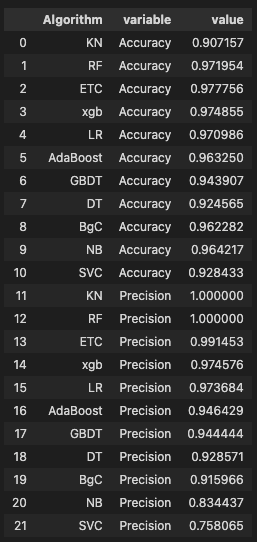

# Email/SMS Spam Classification System
### https://jaehwano-email-sms-spam-classification-system-website-ktrfp7.streamlit.app/
## Steps includes....
1. Data cleaning
2. EDA
3. Text Preprocessing
- Lower Cases
- Tokenization
- Removing special characters
- Removing stop words and punctuation
- Stemming
4. Model building
5. Evalutation
6. Improvement
 

 
7. Website
8. Deploy